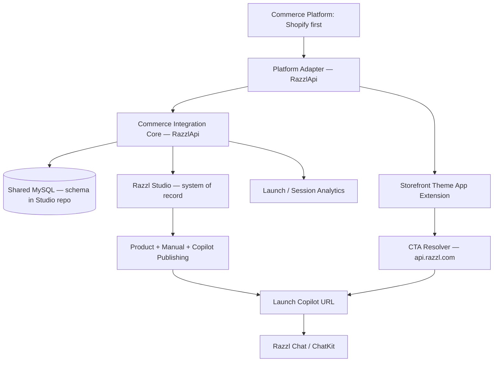

# Commerce Integration Architecture

**Status:** Architecture confirmed (2026-06-28) — schema in DDL; API repo approved  
**Strategy doc:** [`razzl_shopify_presence_integration_initiative.md`](./razzl_shopify_presence_integration_initiative.md)

## Architecture statement

Build a **generic Commerce Integration Core**, deploy it on **`api.razzl.com` (RazzlApi repo)**, and implement **Shopify as the first platform adapter and acquisition connector**. **Razzl Studio** remains the system of record for products, copilots, profile, and Stripe billing.

## System context

## Three-service model

| Service | Repo | Host | Responsibility |
|---------|------|------|----------------|
| **Studio** | `studio` | `studio.razzl.com` | Auth UI, dashboard, copilot editor, profile, Stripe billing |
| **Chat** | `chat` | `chat.razzl.com` | End-customer ChatKit runtime |
| **API** | [RazzlApi](https://github.com/faui/RazzlApi.git) | `api.razzl.com` | Commerce core, Shopify adapter, OAuth, webhooks, CTA resolver, embedded admin API |

All three share **one MySQL database** in the same VPC/ECS cluster. See [`API-REPO.md`](./API-REPO.md).

## Component boundaries

| Component | Repo | Path (RazzlApi) |
|-----------|------|-----------------|
| Commerce Core | RazzlApi | `lib/commerce/core/` |
| Adapter interface | RazzlApi | `lib/commerce/adapters/types.ts` |
| Shopify adapter | RazzlApi | `lib/commerce/adapters/shopify/` |
| Studio contract layer | Studio (read) + RazzlApi (deep links) | Studio APIs + `STUDIO-CONTRACT.md` |
| Storefront CTA resolver | RazzlApi | `app/api/commerce/cta/resolve/` |
| DB schema / migrations | **Studio** | `db/migrations/`, `db/database_schema_*_ddl.sql` |
| Shopify theme extension | RazzlApi | `shopify/extensions/` |

## Non-duplication rule

Commerce integrations **must not** rebuild in Shopify or RazzlApi:

- Studio dashboard, profile, Stripe billing screens
- PDF/manual upload, copilot editor, publishing flows

RazzlApi **may** build: OAuth, sync, mapping API, CTA resolver, webhooks, Shopify embedded admin backend, billing acceptance API.

## Data flow: Shopify merchant activation

1. Install → OAuth on **api.razzl.com** → `commerce_platform_connection`
2. Link/create tenant → deep link to **studio.razzl.com** → `tenant_fk` set (1:1 store↔tenant)
3. Shopify-acquired billing → `commerce_billing_account` (Stripe customers excluded from paid Shopify features)
4. Product sync → `commerce_external_product` / `commerce_external_variant`
5. Map products → `commerce_razzl_product_mapping` (product-level MVP)
6. Enable CTA → `commerce_storefront_cta_config` + per-product overrides on mapping
7. Customer clicks CTA → **api.razzl.com** resolver → ChatKit with `launchsource=shopify`

## Billing separation

| Acquisition | Billing record | Paid Shopify connector features |
|-------------|----------------|--------------------------------|
| Direct Studio | `tenant_subscription` (Stripe) | **No** |
| Shopify App Store | `commerce_billing_account` (Shopify Billing) | **Yes** (after trial/plan) |

Entitlement enforcement is **shared** in Razzl; billing sources are **parallel lanes**.

## Deployment model

| Asset | Location |
|-------|----------|
| Studio app + terraform (shared infra) | `studio` repo |
| API app + terraform (API ECS/ECR) | `RazzlApi` repo — **same terraform patterns** |
| MySQL DDL | `studio/db/` — **single source of truth** |
| ALB host rules | `api.razzl.com`, `studio.razzl.com`, `chat.razzl.com` |

Existing Studio terraform already includes `infra/terraform/ecs_api.tf` as API service placeholder.

## Source control / slices

Each slice uses an isolated branch. **Merge to `origin/main` when the slice is validated** (or when explicitly requested for handoff). This is standard trunk-based development with short-lived feature branches — not an anti-pattern.

See [`IMPLEMENTATION-PLAN.md`](./IMPLEMENTATION-PLAN.md) for slice→repo mapping.

## Related documents

- [`API-REPO.md`](./API-REPO.md) — separate repo setup, Composer multi-root, CI/CD
- [`DATA-MODEL.md`](./DATA-MODEL.md) — schema (applied to Studio DDL)
- [`OPEN-QUESTIONS.md`](./OPEN-QUESTIONS.md) — resolved decisions
- [`../adr/ADR-0002-razzl-api-separate-repo.md`](../adr/ADR-0002-razzl-api-separate-repo.md)
