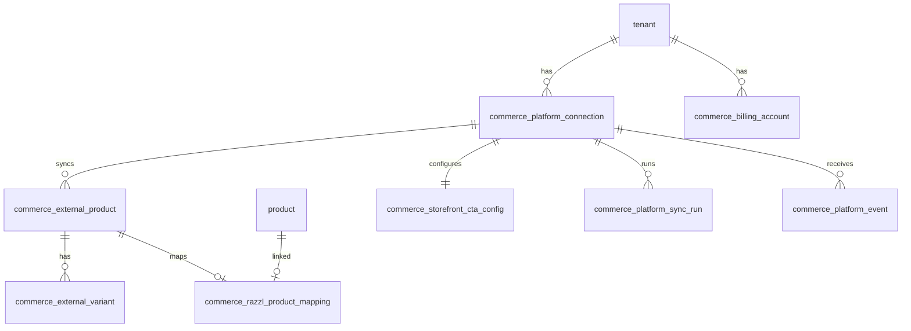

# Commerce Data Model (Proposed)

**Status:** Schema applied to Studio DDL (2026-06-28) — migration `db/migrations/20260628_commerce_core_schema.sql`  
**Naming:** Generic `commerce_*` prefix. Shopify-specific data stays in adapter layer or `raw_platform_payload_json`.  
**Schema owner:** Studio repo (`db/`). RazzlApi consumes shared MySQL.

## Overview

These tables extend the existing Razzl MySQL schema. All commerce tables reference `tenant.tenant_pk` and/or `product.product_pk` where applicable. Studio remains source of truth for products and copilots.

---

## `commerce_platform_connection`

Represents an installed/configured connection between a Razzl tenant and an external commerce platform.

| Column | Type | Nullable | Notes |
|--------|------|----------|-------|
| `commerce_platform_connection_pk` | bigint | NO | PK, auto-increment |
| `tenant_fk` | bigint | YES | FK → `tenant.tenant_pk`; NULL until account linked |
| `platform_type` | varchar(32) | NO | `shopify`, `woocommerce`, `bigcommerce`, `magento`, `custom`, `manual` |
| `external_store_id` | varchar(128) | NO | Platform shop/store ID |
| `store_domain` | varchar(255) | YES | e.g. `mybrand.myshopify.com` |
| `store_display_name` | varchar(255) | YES | |
| `install_status` | varchar(32) | NO | `installed`, `connected`, `disconnected`, `uninstalled`, `error` |
| `auth_type` | varchar(32) | NO | `oauth`, `api_key`, `app_password`, `manual` |
| `access_token_encrypted` | blob/text | YES | Encrypted at rest |
| `refresh_token_encrypted` | blob/text | YES | If applicable |
| `scopes_json` | json | YES | Granted scopes |
| `acquisition_source` | varchar(32) | NO | `direct`, `shopify_app_store`, `outbound`, `partner`, `unknown` |
| `billing_source` | varchar(32) | NO | `stripe`, `shopify_billing`, `platform_billing`, `manual`, `none` |
| `platform_billing_status` | varchar(32) | YES | `not_required`, `pending`, `active`, `cancelled`, `failed` |
| `installed_at` | timestamp | YES | |
| `connected_at` | timestamp | YES | Tenant linked |
| `uninstalled_at` | timestamp | YES | |
| `last_synced_at` | timestamp | YES | |
| `raw_platform_payload_json` | json | YES | Shop metadata snapshot |
| `created_on` | timestamp | NO | DEFAULT CURRENT_TIMESTAMP |
| `updated_on` | timestamp | NO | ON UPDATE CURRENT_TIMESTAMP |

### Indexes / constraints

- **UNIQUE** `(platform_type, external_store_id)` — one connection row per store per platform
- **INDEX** `tenant_fk`
- **INDEX** `install_status`
- **INDEX** `platform_type`
- **FK** `tenant_fk` → `tenant.tenant_pk` ON DELETE SET NULL (preserve commerce audit on tenant delete — OQ-041)

### Resolved

- Uninstalled connections: soft status + anonymize; do not hard-delete audit rows immediately (OQ-060)
- Token encryption: follow existing Secrets Manager conventions (OQ-032)

---

## `commerce_external_product`

Normalized external product row.

| Column | Type | Nullable | Notes |
|--------|------|----------|-------|
| `commerce_external_product_pk` | bigint | NO | PK |
| `commerce_platform_connection_fk` | bigint | NO | FK → connection |
| `platform_type` | varchar(32) | NO | Denormalized for queries |
| `external_product_id` | varchar(128) | NO | Platform product ID |
| `external_handle` | varchar(255) | YES | Shopify handle |
| `title` | varchar(500) | NO | |
| `vendor_or_brand` | varchar(255) | YES | |
| `product_type` | varchar(255) | YES | |
| `status` | varchar(32) | YES | Platform status (active, draft, archived) |
| `primary_image_url` | varchar(600) | YES | |
| `tags_json` | json | YES | |
| `sku_summary` | varchar(500) | YES | Concatenated SKU hint |
| `raw_platform_payload_json` | json | YES | Full platform payload |
| `first_seen_at` | timestamp | NO | |
| `last_synced_at` | timestamp | YES | |
| `deleted_on_platform_at` | timestamp | YES | Soft mark when removed on platform |
| `created_on` | timestamp | NO | |
| `updated_on` | timestamp | NO | |

### Indexes / constraints

- **UNIQUE** `(commerce_platform_connection_fk, external_product_id)`
- **INDEX** `last_synced_at`
- **INDEX** `status`
- **FK** `commerce_platform_connection_fk` → `commerce_platform_connection`

---

## `commerce_external_variant`

Normalized variant/SKU row.

| Column | Type | Nullable | Notes |
|--------|------|----------|-------|
| `commerce_external_variant_pk` | bigint | NO | PK |
| `commerce_platform_connection_fk` | bigint | NO | FK |
| `commerce_external_product_fk` | bigint | NO | FK → external product row |
| `external_product_id` | varchar(128) | NO | Denormalized |
| `external_variant_id` | varchar(128) | NO | |
| `title` | varchar(500) | YES | |
| `sku` | varchar(128) | YES | |
| `barcode` | varchar(128) | YES | |
| `status` | varchar(32) | YES | |
| `option_values_json` | json | YES | e.g. Size: Large |
| `raw_platform_payload_json` | json | YES | |
| `last_synced_at` | timestamp | YES | |
| `created_on` | timestamp | NO | |
| `updated_on` | timestamp | NO | |

### Indexes / constraints

- **UNIQUE** `(commerce_platform_connection_fk, external_product_id, external_variant_id)`
- **INDEX** `sku`
- **FK** `commerce_external_product_fk` → `commerce_external_product`

---

## `commerce_razzl_product_mapping`

Maps an external commerce product to a Razzl Studio product/copilot.

| Column | Type | Nullable | Notes |
|--------|------|----------|-------|
| `commerce_razzl_product_mapping_pk` | bigint | NO | PK |
| `commerce_platform_connection_fk` | bigint | NO | FK |
| `commerce_external_product_fk` | bigint | NO | FK → external product |
| `external_product_id` | varchar(128) | NO | Denormalized |
| `product_fk` | bigint | YES | FK → `product.product_pk`; NULL if unmapped |
| `razzl_code_snapshot` | varchar(20) | YES | Convenience; Studio truth is `product.razzl_code` |
| `product_status_snapshot` | varchar(50) | YES | From `master_product_status.status_code` |
| `launch_url_snapshot` | varchar(600) | YES | Computed URL cache |
| `edit_url_snapshot` | varchar(600) | YES | Studio edit deep link cache |
| `mapping_status` | varchar(32) | NO | `unmapped`, `mapped`, `stale`, `error`, `disabled` |
| `storefront_cta_enabled` | tinyint | NO | DEFAULT 0 |
| `cta_label_override` | varchar(64) | YES | Per-product CTA label (OQ-040) |
| `cta_open_mode_override` | varchar(16) | YES | `same_tab`, `new_tab` |
| `last_verified_at` | timestamp | YES | Optional; MVP uses live reads (OQ-042) |
| `created_on` | timestamp | NO | |
| `updated_on` | timestamp | NO | |

### Indexes / constraints

- **UNIQUE** `(commerce_platform_connection_fk, commerce_external_product_fk)` — one mapping per external product
- **INDEX** `product_fk`
- **INDEX** `mapping_status`
- **INDEX** `storefront_cta_enabled`
- **FK** `product_fk` → `product.product_pk` ON DELETE SET NULL

### Design note

Snapshot columns exist in schema but **MVP uses live reads** from `product` with manual merchant refresh (OQ-042). Snapshots may be populated later for CTA resolver caching.

Per-product CTA: structured columns on mapping (`storefront_cta_enabled`, `cta_label_override`, `cta_open_mode_override`); connection defaults in `commerce_storefront_cta_config`.

---

## `commerce_storefront_cta_config`

Per-connection CTA defaults and behavior.

| Column | Type | Nullable | Notes |
|--------|------|----------|-------|
| `commerce_storefront_cta_config_pk` | bigint | NO | PK |
| `commerce_platform_connection_fk` | bigint | NO | FK, UNIQUE |
| `platform_type` | varchar(32) | NO | |
| `cta_enabled_default` | tinyint | NO | DEFAULT 0 |
| `cta_label_default` | varchar(64) | NO | DEFAULT `Setup help` |
| `cta_open_mode` | varchar(16) | NO | `same_tab`, `new_tab` |
| `cta_style_mode` | varchar(32) | NO | `inherit_theme`, `button`, `link`, `badge` |
| `show_powered_by_razzl` | tinyint | NO | DEFAULT 0 |
| `fallback_behavior` | varchar(32) | NO | `hide`, `disabled`, `support_link` |
| `settings_json` | json | YES | Per-platform overrides |
| `created_on` | timestamp | NO | |
| `updated_on` | timestamp | NO | |

### Indexes / constraints

- **UNIQUE** `commerce_platform_connection_fk`

Per-product CTA override: **`commerce_razzl_product_mapping`** columns (OQ-040). Connection-wide defaults in this table.

---

## `commerce_platform_sync_run`

Audit trail for sync operations.

| Column | Type | Nullable | Notes |
|--------|------|----------|-------|
| `commerce_platform_sync_run_pk` | bigint | NO | PK |
| `commerce_platform_connection_fk` | bigint | NO | FK |
| `platform_type` | varchar(32) | NO | |
| `sync_type` | varchar(32) | NO | `full`, `incremental`, `webhook`, `manual` |
| `status` | varchar(32) | NO | `running`, `succeeded`, `failed`, `partial` |
| `started_at` | timestamp | NO | |
| `completed_at` | timestamp | YES | |
| `products_seen` | int | YES | |
| `products_created` | int | YES | |
| `products_updated` | int | YES | |
| `products_deleted_or_archived` | int | YES | |
| `variants_seen` | int | YES | |
| `error_code` | varchar(64) | YES | |
| `error_message` | text | YES | |
| `metadata_json` | json | YES | |
| `created_on` | timestamp | NO | |

### Indexes / constraints

- **INDEX** `(commerce_platform_connection_fk, started_at DESC)`
- **INDEX** `status`

---

## `commerce_platform_event`

Raw and normalized platform webhook/event log.

| Column | Type | Nullable | Notes |
|--------|------|----------|-------|
| `commerce_platform_event_pk` | bigint | NO | PK |
| `commerce_platform_connection_fk` | bigint | YES | FK; NULL if pre-connection |
| `platform_type` | varchar(32) | NO | |
| `event_type` | varchar(64) | NO | e.g. `product_updated`, `app_uninstalled` |
| `external_event_id` | varchar(128) | YES | Platform event ID |
| `idempotency_key` | varchar(255) | NO | UNIQUE processing key |
| `raw_event_json` | json | NO | |
| `normalized_event_json` | json | YES | Adapter output |
| `processing_status` | varchar(32) | NO | `pending`, `processed`, `ignored`, `failed` |
| `received_at` | timestamp | NO | |
| `processed_at` | timestamp | YES | |
| `error_message` | text | YES | |
| `created_on` | timestamp | NO | |

### Indexes / constraints

- **UNIQUE** `idempotency_key`
- **INDEX** `(commerce_platform_connection_fk, received_at DESC)`
- **INDEX** `processing_status`

---

## `commerce_billing_account`

Platform billing state separate from Stripe `tenant_subscription`.

| Column | Type | Nullable | Notes |
|--------|------|----------|-------|
| `commerce_billing_account_pk` | bigint | NO | PK |
| `tenant_fk` | bigint | NO | FK → `tenant` |
| `commerce_platform_connection_fk` | bigint | YES | FK; NULL for non-platform billing |
| `billing_source` | varchar(32) | NO | `stripe`, `shopify_billing`, `platform_billing`, `manual`, `none` |
| `acquisition_source` | varchar(32) | NO | |
| `billing_plan_external_id` | varchar(128) | YES | Shopify plan/charge ID |
| `platform_billing_charge_id` | varchar(128) | YES | |
| `platform_billing_subscription_id` | varchar(128) | YES | |
| `platform_billing_status` | varchar(32) | NO | |
| `trial_enabled` | tinyint | NO | DEFAULT 1 — admin can disable (OQ-022) |
| `trial_duration_days` | int | NO | DEFAULT 7 |
| `trial_max_products` | int | NO | DEFAULT 1 |
| `billing_effective_at` | timestamp | YES | |
| `billing_cancelled_at` | timestamp | YES | |
| `metadata_json` | json | YES | |
| `created_on` | timestamp | NO | |
| `updated_on` | timestamp | NO | |

### Indexes / constraints

- **INDEX** `tenant_fk`
- **UNIQUE** `(commerce_platform_connection_fk)` where connection FK is not null
- Relationship to existing `tenant_stripe_customer` / `tenant_subscription`: **parallel, not merged** — tenant may have Stripe history plus Shopify billing for connector

---

## Future table: `commerce_launch_event`

Not required for Slice 1 schema but planned for Slice 9:

| Column | Notes |
|--------|-------|
| `tenant_fk`, `commerce_platform_connection_fk` | |
| `external_product_id`, `external_variant_id` | |
| `product_fk`, `razzl_code` | |
| `source` | e.g. `shopify_product_page_cta` |
| `launch_url`, `session_id`, `anonymous_visitor_id` | |
| `metadata_json`, `created_on` | |

---

## Entity relationship (simplified)

---

## Migration approach

1. **Applied:** `db/migrations/20260628_commerce_core_schema.sql`
2. **Baseline updated:** `db/database_schema_20260617_ddl.sql` (commerce_* section)
3. Slice 1 (RazzlApi): TypeScript types in `lib/commerce/types/`
4. Slice 1 (RazzlApi): DB access helpers in `lib/commerce/core/db/`

See [`IMPLEMENTATION-PLAN.md`](./IMPLEMENTATION-PLAN.md) Slice 1.
