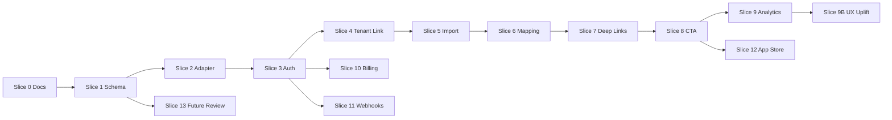

# Commerce Integration Implementation Plan

**Status:** Slice 0 complete; schema DDL applied (2026-06-28); Slice 1 complete (2026-06-29); Slice 2 complete (2026-06-29); Slice 3 complete (2026-06-29)  
**Branch convention:** `slice-NNN-short-description`

## Source control policy

Each slice is developed on **its own branch**. When the slice is validated — or when explicitly requested for handoff — **merge the branch into `origin/main` and sync**. This is standard **trunk-based development with short-lived feature branches** and does not violate best practices, provided:

- Each merge is a complete, tested slice (or docs/schema unit)
- `CONTINUE-HERE.md` is updated before merge
- Schema migrations merge to Studio `main` before RazzlApi code that depends on them

**Repo split:**

| Work | Repo |
|------|------|
| Docs, Studio contracts, **MySQL DDL/migrations** | `studio` |
| Commerce core, Shopify adapter, API routes, terraform, CI/CD | [RazzlApi](https://github.com/faui/RazzlApi.git) |

See [`API-REPO.md`](./API-REPO.md) and [ADR-0002](../adr/ADR-0002-razzl-api-separate-repo.md).

---

## Slice 0: Source-of-truth setup and Studio contract discovery

**Goal:** Documentation and architecture foundation without feature code.

**Scope:** Inspect Studio source; create `/docs/commerce/*`, ADR, `CONTINUE-HERE.md`, `AGENTS.md`.

**Out of scope:** OAuth, billing, sync, migrations, Shopify UI.

**Likely files:** All files under `docs/commerce/`, `docs/adr/`, `CONTINUE-HERE.md`, `AGENTS.md`

**DB changes:** None

**API changes:** None

**UI changes:** None

**Tests:** `npm run lint` (docs-only change)

**Validation:** Docs reference actual Studio routes/tables from source code

**Rollback:** Delete branch

**Composer prompt:**

```text
Complete Slice 0 per docs/commerce/IMPLEMENTATION-PLAN.md. Documentation only. Inspect Studio source for STUDIO-CONTRACT.md. Do not implement commerce code or migrations.
```

**Status:** ✅ Complete (branch `slice-000-commerce-source-of-truth`)

---

## Slice 1: Commerce core schema design/migrations

**Goal:** Add generic `commerce_*` tables and TypeScript types.

**Primary repo:** **Studio** (DDL/migration); **RazzlApi** (types + DB helpers)

**Scope:**
- SQL migration in `studio/db/migrations/` — **DONE:** `20260628_commerce_core_schema.sql`
- Update `studio/db/database_schema_20260617_ddl.sql` — **DONE**
- Types in `RazzlApi/lib/commerce/types/`
- DB helpers in `RazzlApi/lib/commerce/core/db/`

**Out of scope:** Adapter logic, Shopify OAuth, UI.

**Likely files:**
- `studio/db/migrations/20260628_commerce_core_schema.sql` ✅
- `studio/db/database_schema_20260617_ddl.sql` ✅
- `RazzlApi/lib/commerce/types/*.ts`
- `RazzlApi/lib/commerce/core/db/*.ts`

**DB changes:** All tables in `DATA-MODEL.md`

**API changes:** None (optional health check extension)

**UI changes:** None

**Tests:** Migration apply/rollback test; uniqueness constraint tests

**Validation:** Migration applies cleanly on dev DB; no impact on existing Studio tables

**Rollback:** Down migration or drop `commerce_*` tables

**Composer prompt:**

```text
Implement Slice 1: Commerce core schema per docs/commerce/DATA-MODEL.md and IMPLEMENTATION-PLAN.md. Add migration, types, and DB access skeleton. No Shopify adapter. Update CONTINUE-HERE.md. Run lint.
```

**Status:** ✅ Complete (Studio DDL on `main`; RazzlApi types + DB skeleton on `slice-001-commerce-core-schema`)

---

## Slice 2: Platform adapter foundation

**Goal:** Define and implement adapter interface + registry with Shopify placeholder.

**Primary repo:** **RazzlApi**

**Scope:**
- `RazzlApi/lib/commerce/adapters/types.ts` per ADAPTER-CONTRACT.md
- Normalized product/event types
- Shopify adapter skeleton (throws NotImplemented or mock)
- Unit tests with fixture JSON

**Out of scope:** Real Shopify API calls, OAuth.

**Likely files:**
- `lib/commerce/adapters/registry.ts`
- `lib/commerce/adapters/shopify/index.ts`
- `lib/commerce/adapters/shopify/__fixtures__/`
- `lib/commerce/adapters/shopify/*.test.ts`

**DB changes:** None

**API changes:** None

**UI changes:** None

**Tests:** Normalization unit tests; registry tests

**Validation:** All adapter tests pass; lint clean

**Rollback:** Remove adapter files

**Composer prompt:**

```text
Implement Slice 2 per docs/commerce/ADAPTER-CONTRACT.md. Adapter interface, registry, Shopify skeleton with normalization unit tests. No OAuth. Update CONTINUE-HERE.md.
```

**Status:** ✅ Complete (branch `slice-002-adapter-foundation`)

---

## Slice 3: Shopify app skeleton/auth

**Goal:** OAuth install flow and connection persistence on **api.razzl.com**.

**Primary repo:** **RazzlApi**

**Scope:**
- Shopify app config (API key, secret env vars)
- OAuth authorize + callback routes
- HMAC validation
- Encrypt/store token on `commerce_platform_connection`
- Basic embedded admin home (Polaris shell)

**Out of scope:** Tenant linking, product sync, billing.

**Likely files:**
- `app/api/commerce/shopify/auth/*`
- `lib/commerce/adapters/shopify/oauth.ts`
- Shopify app TOML / config (if separate app structure)

**DB changes:** Use connection table from Slice 1

**API changes:** OAuth callback, connection status API

**UI changes:** Minimal embedded home

**Tests:** HMAC validation, token encryption, OAuth callback tests

**Validation:** Install on Shopify dev store creates connection row

**Rollback:** Disable routes; mark connections error

**Composer prompt:**

```text
Implement Slice 3: Shopify OAuth per docs/commerce/SHOPIFY-SPEC.md. Store encrypted tokens. Basic embedded home. Security tests for HMAC. No product sync. Update CONTINUE-HERE.md.
```

**Status:** ✅ Complete (branch `slice-003-shopify-oauth`)

---

## Slice 4: Razzl tenant/account connection

**Status:** Implemented on branch `slice-004-tenant-connection` (RazzlApi) + Studio bridge — pending E2E validation and merge.

**Goal:** Link Shopify connection to Studio tenant.

**Scope:**
- Connect existing account flow (login + confirm link)
- Create account deep link to Studio `/auth/start`
- Update `commerce_platform_connection.tenant_fk`
- Connection status UI in Shopify admin

**Out of scope:** Product sync, billing.

**Likely files:**
- `app/api/commerce/connection/link/route.ts`
- Shopify onboarding UI screens
- `lib/commerce/core/connection-service.ts`

**DB changes:** Populate `tenant_fk`, `connected_at`

**API changes:** Link/unlink tenant APIs

**UI changes:** Onboarding checklist in Shopify admin

**Tests:** Link flow integration tests; unauthorized link rejected

**Validation:** Linked connection shows tenant name; Studio deep links include correct tenant context

**Rollback:** Clear `tenant_fk` on connections

**Composer prompt:**

```text
Implement Slice 4 per STUDIO-CONTRACT.md auth/signup routes. Link Shopify connection to tenant_fk. Deep link to Studio signup/login. No duplicate signup UI in Shopify unless unavoidable. Update CONTINUE-HERE.md.
```

---

## Slice 5: Shopify product import

**Goal:** Import Shopify catalog into commerce tables.

**Scope:**
- `fetchProducts` Shopify implementation
- Sync orchestration service
- Manual "Sync now" UI
- `commerce_platform_sync_run` records

**Out of scope:** Mapping UI, webhooks, auto copilot creation.

**Likely files:**
- `lib/commerce/adapters/shopify/products.ts`
- `lib/commerce/core/sync-service.ts`
- `app/api/commerce/sync/route.ts`
- Shopify Products admin UI

**DB changes:** Writes to external product/variant tables

**API changes:** POST sync trigger, GET sync status

**UI changes:** Products list (import only, no mapping actions yet)

**Tests:** Idempotent sync tests with mocked Admin API

**Validation:** Repeated sync does not duplicate rows; deleted products marked

**Rollback:** Truncate external product tables for connection

**Composer prompt:**

```text
Implement Slice 5: Shopify product import per SHOPIFY-SPEC.md. Idempotent sync into commerce_external_product/variant. Manual sync UI. Mock Admin API tests. Update CONTINUE-HERE.md.
```

---

## Slice 6: Product-to-Razzl copilot mapping

**Goal:** Map external products to Studio products.

**Scope:**
- Mapping service CRUD
- Product picker (Studio products via API)
- Mapping table UI per STYLEGUIDE.md
- Status display from Studio product status

**Out of scope:** Storefront CTA, webhooks.

**Likely files:**
- `lib/commerce/core/mapping-service.ts`
- `app/api/commerce/mappings/*`
- Shopify Products UI (mapping columns/actions)

**DB changes:** `commerce_razzl_product_mapping` writes

**API changes:** Mapping CRUD APIs

**UI changes:** Full mapping table in Shopify admin

**Tests:** Mapping uniqueness; unmap; stale detection

**Validation:** Map/unmap preserves sync data; deep links use correct product_pk

**Rollback:** Delete mapping rows

**Composer prompt:**

```text
Implement Slice 6: Product mapping UI and APIs. Read Studio products via existing /api/products patterns. Deep links per STUDIO-CONTRACT.md. Follow STYLEGUIDE.md table layout. Update CONTINUE-HERE.md.
```

---

## Slice 7: Studio deep links and status sync

**Goal:** Reliable deep links and mapping snapshot refresh.

**Scope:**
- URL builder service using `getPublicOrigin()` + `withBasePath()`
- Launch URL builder from `razzl_code` + `chatKitBaseUrl`
- Status sync job (refresh snapshots from Studio)
- Fix dashboard Edit Copilot base path if in scope

**Out of scope:** Storefront CTA block.

**Likely files:**
- `lib/commerce/core/studio-links.ts`
- `lib/commerce/core/status-sync.ts`
- `app/api/commerce/mappings/refresh/route.ts`

**DB changes:** Update snapshot columns on mapping

**API changes:** Refresh status endpoint

**UI changes:** Launch/Edit actions wired in Shopify admin

**Tests:** URL builder tests with base path; status sync mock tests

**Validation:** Launch URLs match Studio dashboard output for same product

**Rollback:** Disable sync job

**Composer prompt:**

```text
Implement Slice 7: Studio deep link and launch URL builders per STUDIO-CONTRACT.md. Refresh mapping snapshots from product status. Test base path edge cases. Update CONTINUE-HERE.md.
```

---

## Slice 8: Storefront CTA theme app extension

**Goal:** Product-page CTA app block launching Razzl copilot.

**Scope:**
- Theme app extension project
- Public CTA resolver API (mapping → launch URL)
- Fail-closed rendering
- CTA settings UI

**Out of scope:** Launch analytics, checkout extensions.

**Likely files:**
- `shopify/extensions/razzl-cta/` (or equivalent)
- `app/api/commerce/cta/resolve/route.ts`
- CTA settings Shopify admin page

**DB changes:** `commerce_storefront_cta_config` CRUD

**API changes:** Public resolver endpoint (rate limited, shop-scoped)

**UI changes:** CTA settings screen; theme extension

**Tests:** Resolver tests mapped/unmapped; extension liquid/unit tests if applicable

**Validation:** CTA appears on dev store product page when mapped+published; hidden when not

**Rollback:** Disable extension; disable resolver route

**Composer prompt:**

```text
Implement Slice 8: Theme app extension and CTA resolver per SHOPIFY-SPEC.md and STYLEGUIDE.md. Fail closed. No customer PII. Update CONTINUE-HERE.md.
```

---

## Slice 9: Launch tracking

**Goal:** Basic analytics for CTA clicks and launches.

**Scope:**
- `commerce_launch_event` table (migration if not in Slice 1)
- Track click before redirect in app block
- Lightweight analytics UI in Shopify admin

**Out of scope:** Full Studio analytics dashboard.

**Likely files:**
- `db/migrations/*_commerce_launch_event.sql`
- `app/api/commerce/analytics/*`
- Analytics Shopify admin page

**DB changes:** Launch event table

**API changes:** POST launch event, GET summary

**UI changes:** Analytics screen

**Tests:** Event insertion; aggregation queries

**Validation:** Click on dev store creates event row

**Rollback:** Stop tracking; truncate events

**Composer prompt:**

```text
Implement Slice 9: Launch tracking per initiative doc analytics section. Record CTA clicks with source shopify_product_page_cta. Basic Shopify admin summary. Update CONTINUE-HERE.md.
```

**Status:** ✅ Complete

---

## Slice 9B: Embedded admin UX uplift (Polaris)

**Goal:** Replace inline-style MVP embedded admin with state-of-the-art Shopify-native UX per [`STYLEGUIDE.md`](./STYLEGUIDE.md).

**Primary repo:** **RazzlApi**

**Scope:**
- Add `@shopify/polaris` + App Bridge provider shell for `/shopify`
- Connection status card (store avatar, linked tenant, install status)
- Onboarding progress tracker with completion bar (collapses when done)
- Products `IndexTable`: thumbnails, badges, search/filter, sort, row hover, kebab action menus
- CTA settings card with live button preview, toggles, theme-block instructions
- Analytics stat cards, EmptyState, icon refresh
- Page header with primary action (+ Add Copilot), skeleton loading, toast feedback
- Sync now spinner + last-synced timestamp

**Out of scope:** Billing screen (Slice 10), merchant disconnect API (defer — link to Studio), modal open mode, App Bridge session-token API auth (follow-up hardening).

**Likely files:**
- `app/shopify/layout.tsx`, `shopify-polaris-provider.tsx`, `shopify-embedded-home.tsx`
- `app/shopify/shopify-connection-card.tsx`
- Refactor `shopify-*-panel.tsx` components
- `package.json` — Polaris + App Bridge deps

**DB changes:** None

**API changes:** None (UI-only slice)

**UI changes:** Full embedded admin restyle

**Tests:** Lint + build; existing commerce tests unchanged

**Validation:** Open embedded app on dev store — all sections render with Polaris; products table actions work; CTA save shows toast; sync shows loader

**Rollback:** Revert UI files; remove Polaris deps if needed

**Composer prompt:**

```text
Implement Slice 9B: Embedded admin UX uplift per STYLEGUIDE.md and IMPLEMENTATION-PLAN.md. Polaris + App Bridge shell, refactor all /shopify panels. Update CONTINUE-HERE.md in RazzlApi.
```

**Status:** ✅ Complete (branch pending merge)

---

## Slice 9B.1: Embedded admin UX polish (premium pass)

**Goal:** Close team review gaps — premium visual treatment on top of Slice 9B Polaris shell.

**Primary repo:** **RazzlApi**

**Scope:**
- Connection: success/warning `Banner`, nested status panel, larger avatar, live badge
- Onboarding: numbered step circles, progress %, vertical stepper
- Products: outlined Unmapped badge, switch-style CTA toggle, row hover + tighter rows, combined count line (kebab menu retained from 9B)
- CTA settings: header band, side-by-side label + preview panel, switch for Powered by
- Analytics: EmptyState in styled container with illustration
- Shared: `shopify-admin.css`, `ShopifySwitch`, `StatusBadge`, `OnboardingStepper`

**Out of scope:** Same as 9B deferrals (disconnect API, session-token auth, billing).

**Composer prompt:**

```text
Implement Slice 9B.1 per team UX review and SLICE-9B-UX-GAP-REVIEW.md. Premium polish pass. Update CONTINUE-HERE.md.
```

**Status:** ✅ Complete (pending deploy validation)

---

## Slice 10: Shopify Billing/App Pricing

**Goal:** Billing for Shopify-acquired merchants.

**Scope:**
- Shopify Billing API / App Pricing integration
- `commerce_billing_account` writes
- Plan acceptance UI
- Feature gating on billing status

**Out of scope:** Changing Stripe flow for direct customers.

**Likely files:**
- `lib/commerce/adapters/shopify/billing.ts`
- `app/api/commerce/billing/*`
- Billing Shopify admin page

**DB changes:** Billing account records

**API changes:** Create billing session, webhook handler for billing events

**UI changes:** Billing acceptance screen

**Tests:** Billing state machine tests; mock Shopify billing API

**Validation:** Dev store can accept test plan; features gated correctly

**Rollback:** Set billing status cancelled; disable gating

**Composer prompt:**

```text
Implement Slice 10: Shopify Billing per SHOPIFY-SPEC.md. Preserve Stripe for direct customers. Record commerce_billing_account. Gate sync/mapping/CTA. Update CONTINUE-HERE.md.
```

**Status:** ✅ Complete (pending dev-store E2E validation). See [`SLICE-10-DEVIATIONS.md`](./SLICE-10-DEVIATIONS.md) for guideline mapping.

---

## Slice 11: Webhooks/compliance

**Goal:** Product update webhooks, uninstall, mandatory compliance.

**Scope:**
- Webhook registration on install
- HMAC verification + idempotency
- `commerce_platform_event` processing
- Compliance handlers (customer/shop redact)
- Uninstall cleanup

**Out of scope:** Full order/customer sync.

**Likely files:**
- `app/api/commerce/shopify/webhooks/route.ts`
- `lib/commerce/core/event-processor.ts`

**DB changes:** Event log writes

**API changes:** Webhook endpoints (raw body)

**UI changes:** None (optional error surfacing in settings)

**Tests:** HMAC tests, idempotency replay, uninstall handler

**Validation:** Shopify webhook delivery succeeds; duplicate events ignored

**Rollback:** Unregister webhooks via Shopify API

**Composer prompt:**

```text
Implement Slice 11: Shopify webhooks and compliance per SECURITY-COMPLIANCE.md. Idempotent event processing. Uninstall handler. Update CONTINUE-HERE.md.
```

**Status:** ✅ Complete

---

## Slice 12: App Store readiness

**Goal:** Prepare public Shopify App Store submission.

**Scope:**
- Listing copy, screenshots, demo store
- Privacy policy / terms links
- Review checklist execution
- Scope audit

**Out of scope:** New features.

**Likely files:**
- `docs/commerce/APP-STORE-LISTING.md` (optional)
- Demo store configuration docs

**DB changes:** None

**API changes:** None unless review findings

**UI changes:** Polish only

**Tests:** Full E2E checklist

**Validation:** Internal review checklist complete

**Rollback:** N/A (docs/polish)

**Composer prompt:**

```text
Implement Slice 12: App Store readiness checklist per SHOPIFY-SPEC.md and SECURITY-COMPLIANCE.md. Demo store, listing assets, policy links. Update CONTINUE-HERE.md.
```

---

## Slice 13: Future adapter readiness

**Goal:** Validate schema and adapter contract for WooCommerce, BigCommerce, Magento.

**Scope:**
- Review-only: schema gap analysis
- ADR updates if needed
- No adapter implementation

**Out of scope:** Any platform code.

**Likely files:** `docs/commerce/FUTURE-PLATFORMS.md` or ADR updates

**DB changes:** None (optional doc-only schema notes)

**Composer prompt:**

```text
Complete Slice 13: Review commerce schema and ADAPTER-CONTRACT.md against WooCommerce, BigCommerce, Magento needs. Document gaps only. No implementation. Update CONTINUE-HERE.md.
```

---

## Slice dependency graph



Note: Slice 10 (billing) can parallelize with 5–8 after Slice 4, but gating logic must be integrated before App Store submission.
