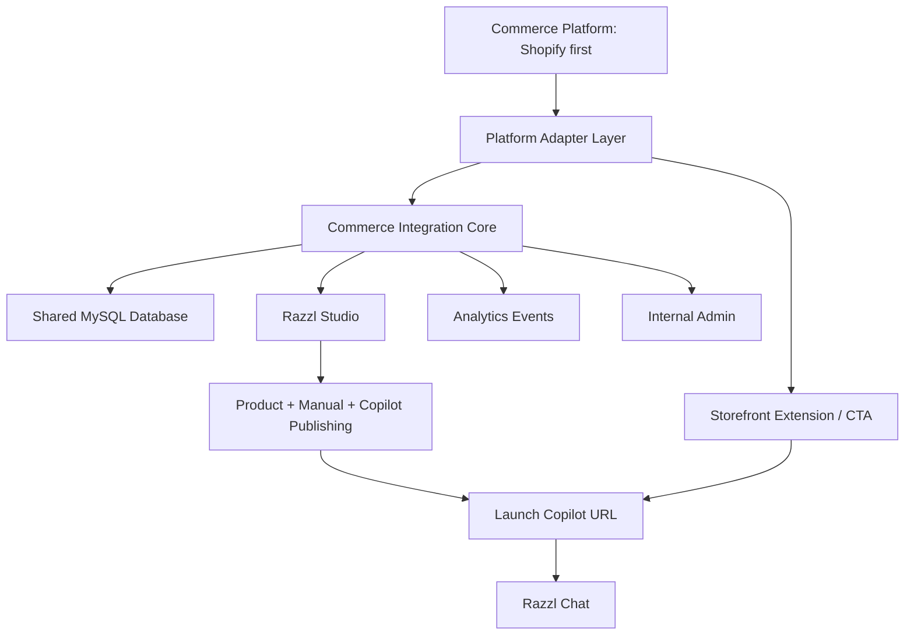
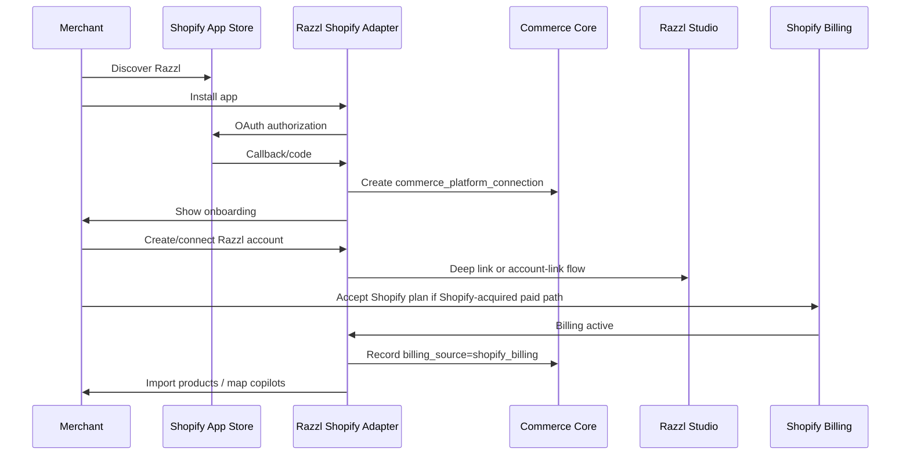
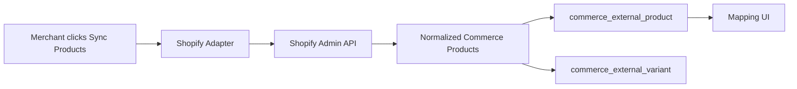
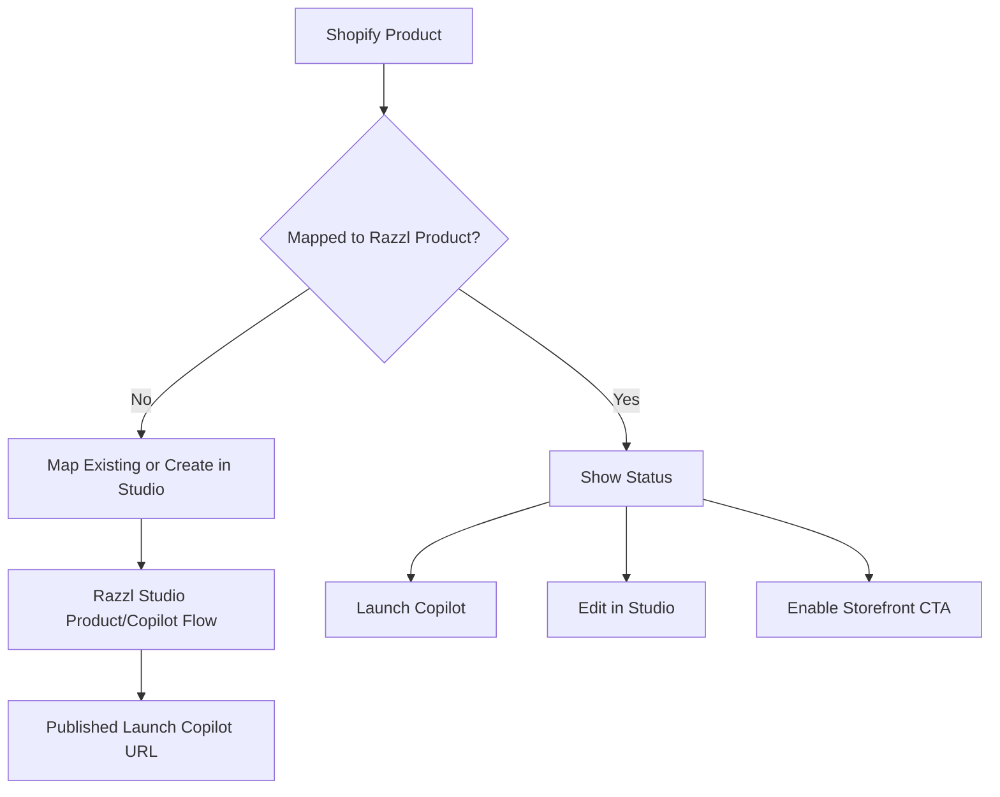
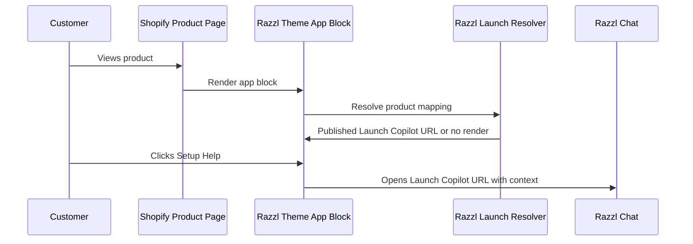
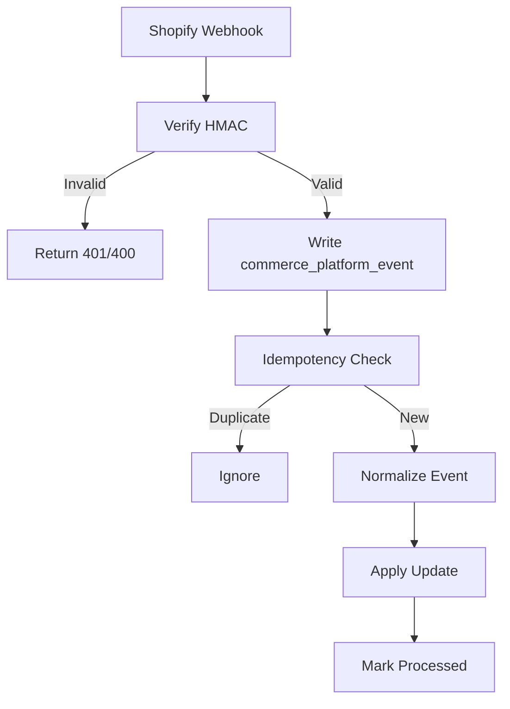

# Razzl Commerce Integration Initiative v6

**Document purpose:** Strategy, product requirements, technical architecture, data model, implementation plan, and Composer 2.5 handoff for Razzl's commerce-platform integration initiative.

**Final architecture statement:** Build a **generic Commerce Integration Core** inside Razzl, then implement **Shopify as the first platform adapter and acquisition connector**. Shopify is the first channel, not the architecture.

**Non-negotiable product boundary:** Razzl Studio remains the system of record for tenant profile, direct signup, Stripe billing, registered products, PDF/manual upload, copilot creation, copilot editing, publishing, and generated chat/launch URLs. Commerce-platform apps must not rebuild Studio flows.

**Primary business objective:** Increase discovery and activation among brands/manufacturers/retailers that already sell on Shopify or arrive at Shopify to set up a store, especially brands with products requiring setup, installation, assembly, configuration, troubleshooting, or post-purchase guidance.

**Primary build objective:** Give those merchants a low-friction path to discover Razzl, sign up through current Razzl flows, correlate commerce products to Razzl products, enable a storefront CTA, and launch the correct Razzl copilot for end customers.

---

## 0. How Composer 2.5 Should Use This Document

This document is intentionally written as a handoff artifact for Composer 2.5 working inside the Razzl Studio codebase.

Composer must treat this document as **strategy and target architecture**, not as proof of the current implementation. Before writing code, Composer must inspect Studio source code and create source-of-truth docs that capture actual routes, data models, services, auth patterns, billing integration, and product/copilot link generation.

### Required Composer behavior

1. Read this document fully.
2. Inspect the Studio repo and source code.
3. Create `/docs/commerce` source-of-truth files before building any Shopify feature.
4. Do not infer Studio routes, DB table names, tenant identifiers, product identifiers, copilot link patterns, or billing states from this document alone.
5. Use the existing Studio implementation wherever possible.
6. Do not duplicate existing Studio screens in Shopify.
7. Implement slices on isolated branches.
8. Update `/CONTINUE-HERE.md` after every session.
9. Add open questions rather than guessing.
10. Keep the repo recoverable if the session stops mid-task.

### First Composer task

Composer's first task is **Slice 0: Source-of-Truth Discovery and Commerce Architecture Setup**. It should not build Shopify OAuth, billing, webhooks, product sync, or UI yet.

---

## 1. Executive Summary

Razzl already has the core product: `studio.razzl.com` is a public, self-service app for brands and manufacturers. Brands register products, provide product setup/installation/assembly materials such as PDF guides, and publish a product-specific conversational copilot. The Studio dashboard shows registered products, and each product exposes actions including **Launch Copilot** and **Edit Copilot**. The Launch Copilot URL is the end-customer support interface and can be placed anywhere: Shopify product pages, QR codes, packaging inserts, manuals, support pages, post-purchase emails, or order/account pages. Studio Profile is the tenant profile. Direct billing is already implemented using Stripe.

Therefore, the commerce initiative must not be framed as "build Razzl inside Shopify." The correct framing is:

> Build a generic **Commerce Integration Core** that lets external commerce platforms discover, correlate, and place Razzl copilots, with Shopify as the first adapter and acquisition connector.

Shopify matters because it is where many brands and manufacturers set up online storefronts and discover tools that help them operate. For Razzl, Shopify is strategically useful as:

- a discovery channel for brands already searching the app ecosystem;
- an activation path into existing Studio signup/product publishing flows;
- a product catalog source for reducing setup friction;
- a storefront CTA placement surface;
- a credibility signal for Shopify-focused brands;
- a future partner/distribution channel.

The initial platform-specific deliverable should be the **Razzl Shopify Acquisition Connector**. It should provide install/auth, account creation or account linking, Shopify product sync, Shopify-product-to-Razzl-product correlation, deep links into Studio for product/copilot workflows, a product-page CTA via a Shopify theme app extension/app block, Shopify Billing for Shopify-acquired merchants, basic launch analytics, uninstall/compliance webhooks, and App Store readiness.

The architecture should be generic enough to later support WooCommerce, BigCommerce, Magento/Adobe Commerce, and other commerce platforms without reworking the core data model. However, only the Shopify adapter should be implemented first. Future platforms should be anticipated by schema and adapter boundaries, not by premature implementation.

---

## 2. Strategic Recommendation

### 2.1 Final recommendation

Razzl should pursue a **Commerce Integration Core + Shopify-first Acquisition Connector** now.

This is neither a lightweight marketing experiment nor a full duplicate Studio inside Shopify. It is a disciplined connector strategy:

- **Commerce Core:** generic platform connection, external product, variant, mapping, CTA configuration, sync, billing source, and event/analytics model.
- **Shopify Adapter:** OAuth, Shopify product sync, Shopify billing, Shopify webhooks, theme app extension/app block, Shopify-specific admin UI.
- **Studio Deep Links:** Shopify surfaces should link to existing Studio screens for product management, copilot editing, tenant profile, and core publishing flows.
- **Studio System of Record:** Studio owns products, manuals, copilots, publishing, direct billing, and generated Launch Copilot URLs.

### 2.2 Why this is strategically right

Razzl's product is already platform-neutral: the end customer only needs a URL to launch the copilot. But brands need discovery and activation. Shopify is attractive because brands setting up storefronts are already in the mindset of adding operational tools. For products that need setup, installation, assembly, troubleshooting, or post-purchase help, Razzl is directly relevant.

Razzl does not need Shopify to function. Razzl needs Shopify to:

1. Put Razzl in front of relevant merchants.
2. Shorten the path from discovery to signup.
3. Reduce manual product setup by importing Shopify catalog data.
4. Correlate Shopify products to Razzl products/copilots.
5. Let merchants add a product-specific CTA without editing theme code.
6. Track the value of Shopify-originated launch events.

### 2.3 Decision matrix

| Option | Recommendation | Reason |
|---|---:|---|
| Do nothing Shopify-specific | Reject | Misses discovery and activation opportunity among Shopify merchants. |
| Shopify launch kit only | Useful but insufficient | Good sales collateral, but not enough for App Store discovery or low-friction CTA install. |
| Shopify-only schema and app | Reject | Creates future migration pain when adding WooCommerce, BigCommerce, Magento. |
| Full duplicate Studio inside Shopify | Strong reject | Duplicates existing product, creates drift, increases support burden. |
| Commerce Core + Shopify Adapter | Adopt | Supports current Shopify goal and future platform expansion. |
| Shopify App Store-first with billing resolved | Adopt cautiously | Required for discovery, but billing/review constraints must be designed up front. |

### 2.4 What to optimize for now

Optimize for:

- Shopify discovery;
- frictionless onboarding into current Studio flows;
- correct product correlation;
- reliable storefront CTA rendering;
- clean billing separation by acquisition channel;
- generic schema and adapter architecture;
- high-quality Composer handoff and anti-drift docs.

Do not optimize initially for:

- rebuilding Studio product creation in Shopify;
- creating a separate Shopify manual upload flow;
- full customer/order data sync;
- helpdesk integrations;
- omnichannel analytics;
- WooCommerce/BigCommerce/Magento implementation;
- a generic ecommerce SDK beyond Razzl's actual needs.

---

## 3. Razzl Product Boundary and Studio Source of Truth

### 3.1 Current Studio facts to preserve

Based on Razzl product context provided by the user:

| Studio surface | Current role | Commerce integration implication |
|---|---|---|
| Dashboard | Shows registered products. | Shopify app should not recreate full Dashboard. It may show mapped Shopify products and deep-link to Studio. |
| Product action menu | Includes Launch Copilot and Edit Copilot. | Launch Copilot URL is the end-customer CTA target; Edit Copilot should be available from Shopify as a deep link. |
| Launch Copilot | Opens product-specific chat/copilot URL. | This URL is the canonical storefront/customer launch target. |
| Edit Copilot | Lets brand edit the copilot. | Shopify should link to this existing Studio flow. |
| Profile | Tenant profile. | Shopify should not duplicate tenant profile, except maybe read-only summary/deep link. |
| Billing | Stripe integration for direct customers. | Shopify-acquired customers need Shopify Billing/App Pricing if distributed through Shopify App Store. |

### 3.2 Non-duplication rule

Commerce integrations must not build duplicate screens for:

- product registration beyond platform correlation/import;
- manual/PDF upload;
- copilot generation;
- copilot editing;
- final review/publishing;
- tenant profile management;
- direct Stripe billing;
- broad Studio dashboard experience.

Commerce integrations may build:

- platform install/auth screens;
- account creation/linking entry point;
- billing acceptance for platform-acquired customers;
- imported product list;
- product correlation table;
- CTA settings;
- platform sync status;
- basic launch analytics;
- links to Studio screens.

### 3.3 Studio route and contract discovery

Composer must inspect Studio and document exact contracts:

| Contract area | Composer must identify |
|---|---|
| Tenant identity | Actual tenant/company table, primary key, auth context. |
| Product identity | Product table, product status, published state, brand/tenant relationship. |
| Launch URL | Where the chat URL is generated/stored; route pattern; query params. |
| Edit URL | Exact Studio route for editing a copilot. |
| Dashboard fields | Product name, status, model/SKU, created/updated dates, action menu behavior. |
| Billing | Stripe customer/subscription fields and plan state. |
| Auth/session | Existing user auth framework and how external deep links should authenticate. |
| APIs/services | Existing service patterns for reading products and publishing/linking copilots. |

Composer must write this into `/docs/commerce/STUDIO-CONTRACTS.md` before implementing Shopify UI.

---

## 4. Commerce Integration Core: Naming and Mental Model

### 4.1 Nomenclature

Use **commerce** as the generic domain prefix. Use **shopify** only for platform-specific code and data.

Preferred names:

| Use | Avoid |
|---|---|
| commerce platform | ecommerce app, Shopify app as architecture |
| commerce connection | shop, store only |
| commerce external product | shopify product as core table |
| commerce product mapping | shopify product mapping as core table |
| commerce adapter | Shopify-only service |
| commerce storefront CTA | Shopify button only |
| platform type | scattered booleans like `is_shopify` |
| acquisition source | hardcoded billing assumptions |

### 4.2 Platform types

Initial enum:

```text
shopify
woocommerce
bigcommerce
magento
custom
manual
```

Only `shopify` is implemented initially. The others are reserved so the schema and service boundaries do not collapse into Shopify-specific design.

### 4.3 Generic architecture principle

The Razzl problem is identical across commerce platforms:

1. A merchant has an external product catalog.
2. A Razzl tenant has Razzl products and copilots.
3. Razzl must correlate external products to Razzl products.
4. A storefront/customer touchpoint must launch the correct Razzl copilot.
5. Razzl must track launches and prove value.

The platform-specific details vary:

- auth model;
- product API;
- webhook/event model;
- billing policy;
- storefront extension mechanism;
- marketplace approval process.

The architecture should separate the generic Razzl workflow from platform-specific adapters.

---

## 5. Shopify Ecosystem Fit

### 5.1 Why Shopify matters

Shopify is relevant because brands use it to establish online commerce operations, and the Shopify App Store is a discovery surface for merchant tools. Shopify's app ecosystem is built around apps that add capabilities to online stores, admin workflows, operations, marketing, fulfillment, support, and storefront customization.

Razzl is not a checkout app and not an end-customer commerce app. Razzl is a product setup support service paid for by brands. Shopify is useful because it can place Razzl in front of the merchant and provide a direct storefront launch point.

### 5.2 Shopify's role for Razzl

| Role | Importance | Explanation |
|---|---:|---|
| Discovery channel | Very high | Brands searching App Store for support, returns, AI, product help, setup, instructions may discover Razzl. |
| Activation channel | High | Install flow can guide merchants to Studio signup and product publishing. |
| Product catalog source | High | Product import reduces friction and manual data entry. |
| Storefront CTA surface | Very high | Product page button launches the product-specific copilot. |
| Billing channel | High for App Store-acquired merchants | Shopify App Store rules require Shopify billing for app charges unless an exception applies. |
| Long-term partner ecosystem | Medium-high | Agencies and Shopify implementation partners can add Razzl as a post-purchase support layer. |
| Core product host | Low | Razzl Studio and Chat already host the core product. |

### 5.3 App Store billing constraint

For Shopify App Store distribution, app charges generally must use Shopify App Pricing or the Shopify Billing API. Shopify states that apps using off-platform billing cannot be distributed through the Shopify App Store unless Shopify has notified the developer otherwise. Shopify's revenue share plan gives developers 100% of the first $1M USD of gross app revenue through the App Store and 85% above that threshold; billing is also subject to a processing fee and applicable taxes.

Design implication:

- Direct Razzl customers continue on Stripe.
- Shopify-discovered/App-Store-acquired customers should use Shopify Billing/App Pricing.
- Pricing for Shopify-acquired customers should account for Shopify revenue share and processing fees.
- The data model needs `billing_source`, `acquisition_source`, and `platform_billing_status`.

### 5.4 Theme app extension fit

The product-page CTA should be implemented through a Shopify theme app extension/app block. Shopify app blocks allow app developers to create blocks that merchants can add to themes without editing theme code. This is a strong fit for Razzl because the merchant needs a button/link on product pages that launches the correct product-specific copilot.

### 5.5 Compliance fit

Public Shopify apps must handle mandatory compliance/privacy webhooks. Razzl should avoid customer/order scopes in the first version to reduce protected customer data complexity. Product/catalog scopes and shop metadata should be enough for the initial connector.

---

## 6. Competitive and Adjacent Landscape

Razzl's exact niche - product-manual-driven conversational setup copilots mapped to products and launched from commerce product pages - is relatively specific. Most adjacent apps fall into broader categories:

- AI customer support chatbots;
- helpdesk automation;
- returns management;
- warranties/product registration;
- order tracking/support;
- product manuals/documentation;
- post-purchase support;
- QR code or product support links.

The white space for Razzl is the combination of:

1. product-specific instructions/manuals as the knowledge source;
2. setup/installation/assembly as the primary problem;
3. product-page and QR launch points;
4. brand-paid subscription;
5. end-customer free usage;
6. no generic chatbot positioning.

### 6.1 Competitor/adjacent categories to research further

Composer or a research agent should maintain a live competitive file, because App Store ratings, review counts, pricing, and category placement change. The initial categories are:

| Category | Example types | Lesson for Razzl |
|---|---|---|
| AI customer support | AI chat support, FAQ chatbot, support deflection | Do not position as generic chatbot; borrow onboarding clarity. |
| Helpdesk | Gorgias-like support tools | Razzl can integrate later, but should not start as a helpdesk. |
| Returns management | Return portal, exchange automation | Razzl can use returns-reduction language, but not be primarily a returns tool. |
| Warranty/product registration | Product registration and warranty claims | Adjacent post-purchase ownership context. |
| Manuals/documentation | Instruction/document widgets | Razzl's differentiation is conversational copilot, not document hosting. |
| QR/product support | QR codes to product support pages | Razzl already supports URLs/QR; Shopify CTA is another launch point. |
| AI shopping assistant | Pre-purchase product advisor | Not Razzl's core; Razzl is post-purchase setup. |

### 6.2 Marketplace revenue comparison

Marketplace revenue share is normal, but platform models differ.

| Platform | Public marketplace revenue model | Strategic implication |
|---|---|---|
| Shopify App Store | 0% revenue share on first $1M USD app revenue, then 15% above threshold; processing fee/taxes apply. | Favorable early. Price Shopify-sourced plans to preserve margin after threshold. |
| Adobe Commerce Marketplace | 85/15 revenue share, provider/developer keeps 85%. | Similar to Shopify after threshold. |
| WooCommerce Marketplace | Vendor receives 70% of sales, implying 30% marketplace share. | Less attractive if all revenue goes through marketplace. |
| BigCommerce/Commerce.com | Public apps not in Unified Billing owe 20% of app-related revenue; Unified Billing has separate terms. | Comparable channel cost; model confirms generic billing abstraction is needed. |

### 6.3 Competitive takeaway

Razzl should treat commerce marketplaces as **acquisition channels with platform tolls**, not as the only billing model. Direct customers remain strategically valuable because Stripe billing preserves margin and avoids platform review dependence.

---

## 7. Recommended Positioning

### 7.1 Primary positioning

**Razzl Product Setup Copilot for Shopify**

Supporting line:

> Add AI setup help to Shopify product pages. Razzl turns your product instructions into a conversational copilot so customers can get unstuck during setup, installation, or assembly.

### 7.2 Internal positioning

**Commerce Integration Core + Shopify-first Acquisition Connector**

Internal product definition:

> A generic commerce integration layer that lets external commerce platforms discover, connect, correlate, and launch Razzl product copilots. Shopify is the first adapter and the first acquisition channel.

### 7.3 Positioning options

| Option | Fit | Pros | Cons | Recommendation |
|---|---:|---|---|---|
| AI product setup copilot | Very high | Precise, differentiated, product-specific. | May need education. | Primary. |
| AI assembly support | High for furniture/equipment | Strong pain point. | Too narrow if Razzl covers broader setup/install. | Use as keyword. |
| AI manual assistant | Medium-high | Clear source material. | Sounds like document Q&A, less outcome-driven. | Secondary. |
| Product support automation | Medium | Broad category discovery. | Too generic/helpdesk-like. | Use cautiously. |
| Post-purchase support assistant | Medium-high | Good lifecycle framing. | Broad; may attract order-tracking/helpdesk expectations. | Secondary. |
| Returns reduction app | Medium | Strong ROI. | Could misclassify Razzl as returns portal. | Use as benefit, not primary. |
| Customer support deflection | Medium | Buyer understands value. | Generic support tool category. | Benefit language. |
| Product instructions assistant | Medium-high | Accurate. | Less compelling than setup copilot. | Keyword. |
| QR-code powered setup support | Medium | Matches real use case. | QR is channel, not core product. | Supporting use case. |
| AI troubleshooting assistant | High | Good for stuck users. | Broad beyond manuals. | Supporting term. |

### 7.4 Terms to avoid as primary positioning

Avoid leading with:

- generic chatbot;
- AI shopping assistant;
- helpdesk replacement;
- returns management;
- documentation viewer;
- product recommendation assistant;
- checkout/upsell tool.

These categories may generate traffic, but they blur Razzl's differentiation.

---

## 8. Functional Requirements

### 8.1 Functional segment overview

| Segment | Scope owner | Build in Commerce Core? | Shopify-specific? |
|---|---|---:|---:|
| Platform install/auth | Adapter | Generic connection record | Shopify OAuth/token exchange |
| Account creation/linking | Studio + Commerce | Generic tenant connection | Shopify admin onboarding |
| Billing | Studio + Adapter | Generic billing source/status | Shopify Billing/App Pricing |
| Product import/sync | Commerce Core | Normalized products/variants | Shopify Admin API |
| Product correlation | Commerce Core | Generic mapping | Shopify product UX |
| Studio deep links | Studio + Commerce | Generic action links | Shopify admin buttons |
| CTA placement | Commerce + Adapter | Generic CTA config | Theme app extension/app block |
| Launch analytics | Commerce Core | Generic events | Shopify source attribution |
| Webhooks | Adapter + Core | Generic platform event log | Shopify topics/HMAC |
| Internal admin | Studio/Internal | Generic integration status | Shopify adapter status |

### 8.2 Account onboarding and activation

**Objective:** Convert Shopify discovery into a Razzl tenant that uses existing Studio flows.

**Personas:** Brand owner, ecommerce manager, support lead, operations manager, Shopify agency partner.

**Merchant flow:**

1. Merchant discovers Razzl in Shopify App Store.
2. Merchant installs app.
3. Shopify OAuth completes.
4. Merchant lands on Razzl embedded app home.
5. Merchant chooses:
   - Create Razzl account;
   - Connect existing Razzl account.
6. If Shopify-acquired and paid path, merchant accepts Shopify plan/billing.
7. Merchant imports Shopify products.
8. Merchant opens Studio to create or publish Razzl copilots.
9. Merchant returns to Shopify to map products and enable CTA.

**Acceptance criteria:**

- Merchant can complete install without manual support.
- Merchant can connect to an existing Studio tenant.
- Merchant can create a new Razzl tenant using the current Studio signup flow.
- Shopify app does not duplicate Studio tenant profile or product-authoring screens.
- Billing source is recorded accurately.

**Composer prompt:**

> Inspect Studio auth/signup and tenant creation flows. Document the exact Studio route/API that a Shopify-acquired merchant should use to create a tenant or connect an existing tenant. Do not implement new tenant creation screens inside Shopify unless no reusable Studio route/API exists; if missing, add an open question.

### 8.3 Billing and plans

**Objective:** Preserve Stripe for direct Razzl customers while supporting Shopify Billing/App Pricing for Shopify App Store-acquired customers.

**Billing rules:**

| Acquisition source | Billing source | Notes |
|---|---|---|
| Direct Studio signup | Stripe | Existing flow. |
| Outbound/direct enterprise | Stripe/manual contract | Existing or sales-led. |
| Shopify App Store signup | Shopify Billing/App Pricing | Required for paid App Store-distributed app charges unless exception. |
| Existing Stripe customer installs Shopify connector | Existing Stripe | Connector may be included in plan; verify App Store policy before public distribution. |

**Functional requirements:**

- Store acquisition source.
- Store billing source.
- Store external billing identifiers.
- Gate Shopify functionality based on billing status for Shopify-acquired merchants.
- Avoid showing Stripe billing screen in Shopify-acquired paid flow unless policy/legal decision permits.
- Link direct customers to existing Studio billing screen.

**Open decision:**

- Whether an existing Stripe customer who installs the public Shopify app can use the app without Shopify Billing. This needs policy/legal validation before App Store submission.

### 8.4 Product import and sync

**Objective:** Reduce merchant friction by importing Shopify product catalog into Razzl's commerce mapping layer.

**Functional requirements:**

- Fetch Shopify products.
- Normalize into `commerce_external_product` records.
- Fetch variants/SKUs into `commerce_external_variant` records.
- Preserve raw platform payload for debugging.
- Display sync status.
- Support manual refresh.
- Later support scheduled sync and webhook-triggered incremental sync.
- Do not automatically create Razzl copilots unless explicitly designed later.

**Data fields:**

- external product ID;
- title;
- handle/slug;
- status;
- vendor/brand;
- product type/category;
- tags;
- images;
- variants/SKUs;
- last synced timestamp;
- raw JSON.

**Acceptance criteria:**

- Product list imports without duplicating existing rows.
- Repeated sync is idempotent.
- Deleted/unpublished products are marked, not silently lost.
- Mapping status is preserved across syncs.

### 8.5 Product correlation

**Objective:** Map an external commerce product to a Razzl Studio product/copilot.

**Functional requirements:**

- Show external products from Shopify.
- Show mapping state:
  - unmapped;
  - mapped to Razzl product;
  - Razzl product draft;
  - copilot processing;
  - copilot ready;
  - copilot published;
  - stale/error.
- Provide actions:
  - Map existing Razzl product;
  - Create/open product in Studio;
  - Edit Copilot in Studio;
  - Launch Copilot;
  - Enable/disable CTA;
  - Resync product.
- Store canonical Razzl product ID and Launch Copilot URL.
- Do not store a stale copy of Studio product truth without sync/version metadata.

**Product table example:**

| Commerce Product | Razzl Product | Copilot Status | CTA | Actions |
|---|---|---|---|---|
| Standing Desk | Mapped | Published | On | Launch, Edit in Studio, Disable CTA |
| Patio Set | Mapped | Draft | Off | Edit in Studio |
| Chair | Unmapped | None | Off | Map Existing, Create in Studio |

### 8.6 Storefront CTA

**Objective:** Add a product-specific launch point on the Shopify storefront.

**MVP CTA:**

- Product-page app block via theme app extension.
- Default label: `Setup help`.
- Alternate labels: `Assembly help`, `Ask setup copilot`, `Product setup help`, `Installation help`.
- Only render if product is mapped and has a published Razzl Launch Copilot URL.
- Open Razzl chat URL in same tab or new tab based on setting.
- Include signed/contextual launch parameters where appropriate.
- Fail closed: no broken CTA if mapping missing.

**Do not build first:**

- checkout integrations;
- customer-account extensions;
- order detail integrations;
- post-purchase email injection;
- global floating widget;
- customer identity passthrough.

### 8.7 Chat/copilot launch

**Objective:** Launch the correct Razzl copilot for the product the end customer is viewing.

**Launch context:**

- tenant ID;
- commerce connection ID;
- platform type;
- external product ID;
- external variant ID if available;
- Razzl product ID;
- source = Shopify product page CTA;
- language/locale if available;
- timestamp;
- signature if URL contains trusted context.

**Privacy rule:**

Do not pass customer personal data in MVP. The copilot is free for end customers and does not need purchase/order identity to deliver setup help.

### 8.8 Analytics and reporting

**Objective:** Show that Shopify CTA launches are being used and which products generate setup questions.

**MVP analytics:**

- CTA impressions if feasible;
- CTA clicks;
- chat launches;
- sessions by product;
- escalations by product if available;
- unmapped products count;
- top products by setup help demand.

**Studio vs Shopify:**

- Shopify admin app can show lightweight product-level launch metrics.
- Full analytics should live in Studio long term.

### 8.9 Internal Razzl admin

Internal tooling should let Razzl staff inspect:

- commerce connections;
- tenant mapping;
- billing source;
- sync status;
- product mapping status;
- webhook failures;
- CTA configuration;
- launch events;
- last errors;
- uninstall state.

---

## 9. Technical Architecture

### 9.1 Target architecture



### 9.2 Component overview

| Component | Generic or Shopify-specific? | Purpose |
|---|---|---|
| Commerce Core | Generic | Data model, sync orchestration, mapping, CTA config, events. |
| Commerce Adapter Interface | Generic | Defines platform adapter contract. |
| Shopify Adapter | Shopify-specific | OAuth, product API, webhooks, billing, theme extension. |
| Studio Contract Layer | Razzl-specific | Reads product/copilot/tenant status and deep-link URLs. |
| Storefront CTA Service | Generic + adapter | Resolves product mapping to launch URL. |
| Billing Source Service | Generic + adapter | Separates Stripe/direct from Shopify-acquired billing. |
| Analytics Service | Generic | Tracks launches and source attribution. |
| Internal Admin Views | Generic | Support/debugging. |

### 9.3 Should `api` be a Next.js app on Fargate?

Recommended approach:

- Use an `api` surface only if it aligns with current deployment and repo patterns.
- Since Studio and Chat are Next.js apps on AWS Fargate with shared MySQL and Terraform, a Next.js API surface on the same cluster can be pragmatic for consistency.
- However, structure the code so platform adapters and core services are reusable packages/modules, not trapped inside route handlers.

Recommended layout if starting inside Studio repo:

```text
/apps/studio                 # existing Studio app, if monorepo or future state
/apps/chat                   # existing Chat app, future monorepo only
/apps/api                    # external integration API, if separate app is added
/packages/commerce-core      # generic commerce services and types
/packages/commerce-shopify   # Shopify adapter
/packages/db                 # DB access/migrations if extracted
/packages/observability      # logging/errors/tracing helpers
/docs/commerce               # source-of-truth docs
/infra/terraform             # IaC
```

If the current repo is not a monorepo, use an interim structure that can be migrated later:

```text
/src/commerce/core
/src/commerce/adapters/shopify
/src/commerce/ui/shopify
/src/commerce/services
/src/commerce/types
/docs/commerce
```

### 9.4 Next.js vs Node/Fastify vs Lambda

| Option | Pros | Cons | Recommendation |
|---|---|---|---|
| Next.js API on Fargate | Consistent with current stack; easy UI/API co-location. | Needs careful webhook latency and raw-body handling. | Good near-term. |
| Node/Fastify service | Clean API backend, efficient webhooks. | New service shape. | Consider later if webhooks grow. |
| API Gateway + Lambda | Good for webhooks and bursty events. | More IaC and split logic. | Good for future webhook ingestion if needed. |
| Put everything in Studio | Fastest. | Can blur boundaries. | Acceptable only if `/src/commerce` boundaries are strict. |

### 9.5 Adapter interface

```ts
export type CommercePlatformType =
  | 'shopify'
  | 'woocommerce'
  | 'bigcommerce'
  | 'magento'
  | 'custom'
  | 'manual';

export interface CommercePlatformAdapter {
  platformType: CommercePlatformType;

  validateConnection(input: ValidateConnectionInput): Promise<ConnectionValidationResult>;

  exchangeAuthCode?(input: ExchangeAuthCodeInput): Promise<AuthResult>;

  fetchProducts(input: FetchProductsInput): Promise<NormalizedCommerceProductPage>;

  fetchProductById(input: FetchProductByIdInput): Promise<NormalizedCommerceProduct | null>;

  registerWebhooks?(input: RegisterWebhooksInput): Promise<WebhookRegistrationResult>;

  verifyWebhookSignature(input: VerifyWebhookSignatureInput): Promise<boolean>;

  normalizeWebhook(input: NormalizeWebhookInput): Promise<NormalizedCommerceEvent>;

  getBillingStatus?(input: GetBillingStatusInput): Promise<PlatformBillingStatus>;

  createBillingSession?(input: CreateBillingSessionInput): Promise<PlatformBillingSession>;
}
```

Rules:

- Keep adapter methods minimal.
- Only add methods needed by Razzl.
- Do not implement future adapters yet.
- Every adapter must return normalized Razzl commerce types.

---

## 10. Data Model

### 10.1 Core tables

#### `commerce_platform_connection`

Represents an installed or configured connection between a Razzl tenant and an external commerce platform.

```text
id
tenant_id
platform_type                  -- shopify, woocommerce, bigcommerce, magento, custom, manual
external_store_id
store_domain
store_display_name
install_status                 -- installed, connected, disconnected, uninstalled, error
auth_type                      -- oauth, api_key, app_password, manual
access_token_encrypted
refresh_token_encrypted
scopes_json
acquisition_source             -- direct, shopify_app_store, outbound, partner, unknown
billing_source                 -- stripe, shopify_billing, platform_billing, manual, none
platform_billing_status        -- not_required, pending, active, cancelled, failed
installed_at
connected_at
uninstalled_at
last_synced_at
raw_platform_payload_json
created_at
updated_at
```

#### `commerce_external_product`

Normalized external product row.

```text
id
connection_id
platform_type
external_product_id
external_handle
title
vendor_or_brand
product_type
status
primary_image_url
tags_json
sku_summary
raw_platform_payload_json
first_seen_at
last_synced_at
created_at
updated_at
```

#### `commerce_external_variant`

Normalized variant/SKU row.

```text
id
connection_id
external_product_id
external_variant_id
title
sku
barcode
status
option_values_json
raw_platform_payload_json
last_synced_at
created_at
updated_at
```

#### `commerce_product_mapping`

Maps an external commerce product to a Razzl Studio product.

```text
id
connection_id
external_product_row_id
external_product_id
razzl_product_id
razzl_product_status_snapshot
razzl_copilot_status_snapshot
razzl_launch_url_snapshot
razzl_edit_url_snapshot
mapping_status                 -- unmapped, mapped, stale, error, disabled
storefront_cta_enabled
last_verified_at
created_at
updated_at
```

The snapshots are convenience fields only. Studio remains the source of truth. Composer must determine whether snapshots are needed or whether live joins/service calls are preferable.

#### `commerce_storefront_cta_config`

```text
id
connection_id
platform_type
cta_enabled_default
cta_label_default
cta_open_mode                  -- same_tab, new_tab
cta_style_mode                 -- inherit_theme, button, link, badge
show_powered_by_razzl
fallback_behavior              -- hide, disabled, support_link
settings_json
created_at
updated_at
```

#### `commerce_platform_sync_run`

```text
id
connection_id
platform_type
sync_type                      -- full, incremental, webhook, manual
status                         -- running, succeeded, failed, partial
started_at
completed_at
products_seen
products_created
products_updated
products_deleted_or_archived
variants_seen
error_code
error_message
metadata_json
```

#### `commerce_platform_event`

```text
id
connection_id
platform_type
event_type                     -- product_updated, product_deleted, app_uninstalled, billing_changed, compliance_request, etc.
external_event_id
idempotency_key
raw_event_json
normalized_event_json
processing_status              -- pending, processed, ignored, failed
received_at
processed_at
error_message
```

#### `commerce_launch_event`

```text
id
tenant_id
connection_id
platform_type
external_product_id
external_variant_id
razzl_product_id
source                         -- shopify_product_page_cta, qr, manual_pdf, support_page, etc.
launch_url
session_id
anonymous_visitor_id
created_at
metadata_json
```

### 10.2 Index and uniqueness recommendations

- Unique `(platform_type, external_store_id)` where applicable.
- Unique `(connection_id, external_product_id)` for products.
- Unique `(connection_id, external_product_id, external_variant_id)` for variants.
- Unique `(connection_id, external_product_row_id)` for mappings if one Razzl product per external product.
- Index `tenant_id`, `connection_id`, `mapping_status`, `platform_type`, `last_synced_at`.
- Idempotency index on `commerce_platform_event.idempotency_key`.

### 10.3 Billing fields

Billing must be generic because different platforms use different billing models.

```text
acquisition_source: direct | shopify_app_store | outbound | partner | unknown
billing_source: stripe | shopify_billing | platform_billing | manual | none
billing_plan_external_id
platform_billing_charge_id
platform_billing_subscription_id
platform_billing_status
billing_effective_at
billing_cancelled_at
```

---

## 11. Integration Flows

### 11.1 Shopify discovery to activation



### 11.2 Product sync



### 11.3 Product correlation and Studio deep link



### 11.4 Storefront launch



### 11.5 Webhook handling



---

## 12. Shopify Adapter Specification

### 12.1 Required Shopify scopes

Initial scopes should be the minimum needed for product import, app installation, billing, and theme extension behavior. Composer must confirm exact scopes from current Shopify docs and chosen APIs.

Likely scope areas:

- read products;
- manage app billing;
- app/uninstall webhooks;
- compliance webhook configuration;
- theme app extension does not generally require broad theme editing if using app blocks.

Avoid customer/order scopes in v1.

### 12.2 Shopify admin app screens

Build only these screens:

1. **Home / Onboarding**
   - Explain Razzl.
   - Create Razzl account.
   - Connect existing Razzl account.
   - Show checklist.

2. **Billing**
   - Shopify-acquired merchants accept Shopify plan.
   - Existing direct customers show current connection status and link to Studio billing if appropriate.

3. **Products**
   - Imported Shopify products.
   - Mapping status.
   - Razzl product/copilot status.
   - Actions: Map, Create in Studio, Edit in Studio, Launch Copilot, Enable CTA.

4. **CTA Settings**
   - Default label.
   - Open mode.
   - Style mode.
   - Per-product enable/disable.

5. **Analytics**
   - Basic launches by product.
   - Products missing mapping.
   - CTA enabled count.

6. **Settings / Connection**
   - Connected Studio tenant.
   - Sync status.
   - Disconnect instructions.
   - Support link.

### 12.3 Shopify app block behavior

- App block can be added to product template.
- It reads current product context.
- It resolves mapping using external product ID/handle.
- If no published Razzl launch URL, it renders nothing.
- If published, it renders configured CTA.
- It tracks launch event before redirect/open.

### 12.4 Shopify billing strategy

For App Store-acquired merchants:

- Use Shopify App Pricing or Billing API.
- Record billing source as `shopify_billing`.
- Gate connector activation until billing accepted unless free trial/free plan is chosen.

For existing Studio/Stripe merchants:

- Connect account to Razzl tenant.
- Record acquisition source and billing source accurately.
- Validate policy before public App Store submission if allowing paid functionality without Shopify Billing.

---

## 13. Future Platform Readiness

### 13.1 WooCommerce

WooCommerce integrations commonly use REST API keys and webhooks. Future WooCommerce adapter likely needs:

- store URL;
- consumer key/secret or OAuth/application password approach;
- product REST API import;
- webhook registration or merchant-created webhook instructions;
- WordPress plugin/block/shortcode for CTA placement;
- separate billing path, likely Stripe/direct unless listed and sold through Woo Marketplace.

### 13.2 BigCommerce

BigCommerce adapter likely needs:

- app install/auth;
- store hash/context;
- catalog products API;
- webhooks/events;
- storefront script/widget or app extension equivalent;
- platform partner/revenue-share consideration.

### 13.3 Magento/Adobe Commerce

Magento/Adobe Commerce adapter likely needs:

- module/extension or API credentials;
- catalog API sync;
- webhook/events support depending on edition/configuration;
- storefront block/module for CTA placement;
- Adobe Commerce Marketplace revenue-share consideration if distributed there.

### 13.4 What not to do now

Do not implement these adapters now. Only design the Commerce Core so they can be added without schema rewrites.

---

## 14. UI and Style Guide Requirements

Create `/docs/commerce/STYLEGUIDE.md` in Slice 0.

### 14.1 Three visual contexts

| Context | Style rule |
|---|---|
| Shopify embedded admin | Should feel native to Shopify admin while retaining Razzl brand clarity. |
| Razzl Studio | Existing Studio styles remain unchanged. |
| Storefront CTA | Inherit merchant theme by default; avoid intrusive Razzl styling. |

### 14.2 Shopify admin style principles

- Simple onboarding checklist.
- Clear boundary between Shopify connector and Studio.
- Use status badges: Unmapped, Draft, Processing, Published, CTA On, CTA Off, Error.
- Make primary action obvious.
- Use deep links labeled clearly: `Open in Razzl Studio`, `Edit Copilot`, `Launch Copilot`.
- Avoid exposing internal IDs unless in debug view.
- Provide merchant-friendly empty states.

### 14.3 Storefront CTA style principles

- Default: inherit theme fonts/colors.
- Configurable text.
- Conservative button styling.
- Optional subtle `Powered by Razzl` setting.
- Fail closed if mapping missing.
- Mobile first.

### 14.4 Suggested copy

| Context | Copy |
|---|---|
| App title | Razzl Product Setup Copilot |
| Tagline | Add AI setup help to your product pages. |
| CTA default | Setup help |
| Alternative CTA | Assembly help, Installation help, Ask setup copilot |
| Empty state | Import your Shopify products, then connect them to Razzl copilots. |
| Unmapped action | Create in Razzl Studio |
| Published action | Enable product-page CTA |

---

## 15. Security, Privacy, Compliance, and Review

### 15.1 Security requirements

- Encrypt platform access tokens at rest.
- Never log access tokens, HMAC secrets, billing IDs with sensitive values, or auth codes.
- Validate Shopify HMAC/signatures for webhooks and OAuth callbacks.
- Use idempotency for webhook processing.
- Restrict scopes to minimum required.
- Avoid customer/order data in v1.
- Add rate limit handling for platform APIs.
- Add structured error logging.

### 15.2 Privacy requirements

- Do not pass end-customer personal data to Razzl Chat from Shopify in MVP.
- Do not request protected customer data scopes in v1.
- Implement Shopify mandatory compliance webhooks for public app readiness.
- On uninstall/redaction, handle data deletion/anonymization according to legal/product policy.

### 15.3 App review requirements

For Shopify public App Store path, prepare:

- working embedded admin UI;
- clear app functionality that matches listing;
- billing through Shopify App Pricing/Billing for app charges;
- mandatory compliance webhooks;
- privacy policy;
- terms of service;
- support contact;
- demo store;
- listing screenshots/video;
- accurate app categorization;
- minimal, justified scopes.

### 15.4 Revenue-share implications

The platform fee is a channel cost. It should not be blended silently into direct Stripe economics.

Recommended pricing model:

- Direct Studio plan: current Stripe model.
- Shopify App Store plan: Shopify Billing/App Pricing with pricing adjusted for platform revenue share and processing fees.
- Enterprise: direct contract if not App Store-sourced or as legal/platform policy allows.

---

## 16. Implementation Plan

### Slice 0: Source-of-Truth Discovery and Commerce Architecture Setup

**Goal:** Prepare repo for drift-free commerce integration work.

**Scope:**

- Inspect Studio source code.
- Document actual Studio routes, DB tables, auth, product/copilot lifecycle, Launch Copilot URL generation, Edit Copilot route, Profile, Billing.
- Create `/docs/commerce` docs.
- Create ADRs.
- Create generic Commerce Core architecture and data model.
- Do not implement Shopify code yet.

**Deliverables:**

```text
/docs/commerce/README.md
/docs/commerce/STUDIO-CONTRACTS.md
/docs/commerce/ARCHITECTURE.md
/docs/commerce/DATA-MODEL.md
/docs/commerce/ADAPTER-CONTRACT.md
/docs/commerce/SHOPIFY-SPEC.md
/docs/commerce/STYLEGUIDE.md
/docs/commerce/IMPLEMENTATION-PLAN.md
/docs/commerce/OPEN-QUESTIONS.md
/docs/adr/ADR-0001-commerce-core-shopify-first.md
/CONTINUE-HERE.md
/AGENTS.md
```

**Pass criteria:**

- No code feature changes.
- Docs identify exact current Studio source truth.
- Open questions are explicit.
- Next slice is clear.

### Slice 1: Commerce Core Schema

**Goal:** Add generic commerce tables and migration tests.

**Scope:**

- Add schema/migrations for core tables.
- Add types/enums.
- Add DB access/service skeleton.
- Add test fixtures.

**Out of scope:** Shopify OAuth, UI, billing.

### Slice 2: Commerce Adapter Contract and Shopify Adapter Skeleton

**Goal:** Define and implement the minimal adapter interface with a Shopify placeholder.

**Scope:**

- Adapter types.
- Normalized product types.
- Shopify adapter skeleton.
- Unit tests for normalization with mock payloads.

### Slice 3: Shopify App Install/Auth Foundation

**Goal:** Install Shopify app and create commerce connection.

**Scope:**

- OAuth/token exchange per chosen Shopify app architecture.
- Store token encrypted.
- Connection status.
- Basic embedded admin home.
- Mandatory security tests.

### Slice 4: Studio Account Link / Tenant Connection

**Goal:** Link Shopify connection to Studio tenant.

**Scope:**

- Existing tenant connect flow.
- New account deep link into Studio signup.
- Connection state UI.
- No duplicate Studio signup unless required by existing architecture.

### Slice 5: Shopify Billing for Shopify-Acquired Merchants

**Goal:** Support Shopify Billing/App Pricing for App Store-acquired paid merchants.

**Scope:**

- Billing status model.
- Plan acceptance flow.
- Gate product/CTA features based on billing.
- Preserve Stripe for direct customers.

### Slice 6: Product Sync MVP

**Goal:** Import Shopify products into generic commerce tables.

**Scope:**

- Fetch products.
- Normalize products/variants.
- Store sync run.
- Manual refresh UI.
- Error handling.

### Slice 7: Product Correlation UI

**Goal:** Map Shopify products to Razzl Studio products.

**Scope:**

- Products table.
- Map existing Razzl product.
- Deep links to Studio create/edit/launch.
- Show status.

### Slice 8: Storefront CTA via Theme App Extension

**Goal:** Add product-page CTA that launches Razzl copilot.

**Scope:**

- Theme app extension/app block.
- Product mapping resolution.
- Configurable label.
- Fail-closed rendering.
- Launch tracking.

### Slice 9: Webhooks and Compliance

**Goal:** Handle product updates, app uninstall, and mandatory compliance webhooks.

**Scope:**

- HMAC verification.
- Idempotency.
- Event log.
- Uninstall behavior.
- Privacy compliance handlers.

### Slice 10: Analytics MVP

**Goal:** Show basic product-level value.

**Scope:**

- CTA clicks/launches.
- Sessions if available.
- Product-level summary.
- Missing mapping summary.

### Slice 11: App Store Readiness

**Goal:** Prepare public Shopify App Store submission.

**Scope:**

- Listing copy.
- Screenshots.
- Demo store.
- Support docs.
- Privacy/terms links.
- Review checklist.

### Slice 12: Future Adapter Preparation Review

**Goal:** Validate that core schema can support WooCommerce, BigCommerce, Magento.

**Scope:**

- No implementation.
- Review schema against future platform needs.
- Add ADRs if needed.

---

## 17. Drift-Free Composer Development Process

### 17.1 Branching

Every slice uses its own branch:

```text
slice-000-commerce-source-of-truth
slice-001-commerce-core-schema
slice-002-shopify-adapter-skeleton
slice-003-shopify-auth
...
```

Rules:

1. Implement only the current slice.
2. Run tests.
3. Update docs.
4. Update `/CONTINUE-HERE.md`.
5. Commit with explicit message.
6. Merge only after validation.

### 17.2 Source-of-truth hierarchy

1. Current code on `origin/main`.
2. `/docs/commerce/STUDIO-CONTRACTS.md`.
3. `/docs/commerce/IMPLEMENTATION-PLAN.md`.
4. `/docs/commerce/ARCHITECTURE.md`.
5. `/docs/commerce/DATA-MODEL.md`.
6. `/docs/commerce/ADAPTER-CONTRACT.md`.
7. `/docs/commerce/SHOPIFY-SPEC.md`.
8. `/docs/commerce/STYLEGUIDE.md`.
9. Tests.
10. Terraform/IaC.
11. Session transcripts are not source of truth.

### 17.3 Composer operating rules

- Read docs before coding.
- Inspect current branch/status.
- Do not rely on chat memory.
- Do not infer undocumented Studio behavior.
- Do not add Shopify-specific fields to generic tables unless truly platform-specific and isolated.
- Do not implement WooCommerce/BigCommerce/Magento now.
- Do not duplicate Studio screens.
- Add tests for every service.
- Add idempotency tests for webhooks.
- Add migration rollback strategy if applicable.
- Do not hardcode secrets.
- Do not change production Terraform without explicit slice scope.

### 17.4 `/CONTINUE-HERE.md` format

```markdown
# Continue Here

## Current status

## Current branch

## Last completed slice

## Current slice

## Exact next steps

## Commands to run

## Files modified

## Tests added/updated

## Validation status

## Known issues

## Open questions

## Do-not-change warnings

## Recovery instructions if session crashed
```

---

## 18. Testing Strategy

### 18.1 Test categories

| Category | Examples |
|---|---|
| Unit tests | Normalizers, adapter methods, URL builders, mapping logic. |
| DB tests | Migration, uniqueness, idempotency, deletion/uninstall behavior. |
| Integration tests | Shopify OAuth callbacks, product sync with mocked API, billing states. |
| Webhook tests | HMAC verification, replay/idempotency, malformed payloads. |
| UI tests | Product mapping table, empty states, CTA settings. |
| E2E tests | Install -> connect tenant -> sync products -> map -> enable CTA -> launch. |
| Security tests | Token redaction, encrypted storage, invalid signatures. |
| Regression tests | Existing Studio Dashboard/Launch/Edit/Profile/Billing unaffected. |

### 18.2 Must-have tests before App Store submission

- OAuth callback validation.
- Token storage encryption path.
- Product sync idempotency.
- Uninstall behavior.
- Mandatory compliance webhooks.
- Billing active/inactive gates.
- Theme app block rendering with mapped/unmapped products.
- Launch tracking.
- Studio deep link correctness.

---

## 19. Risks and Mitigations

| Risk | Severity | Mitigation |
|---|---:|---|
| Composer rebuilds Studio in Shopify | High | Non-duplication rule, Slice 0 Studio contracts, ADR. |
| Schema becomes Shopify-specific | High | Commerce Core naming, adapter contract, generic tables. |
| Billing policy mistake | High | Separate billing source/acquisition source, validate before App Store submission. |
| App Store review delay | Medium-high | Build review checklist and demo store early. |
| Theme CTA fails on some themes | Medium | Use app block, fail closed, document compatible themes. |
| Customer data scope triggers review burden | Medium-high | Avoid customer/order scopes in v1. |
| Product mapping gets stale | Medium | Sync status, last verified timestamp, stale state. |
| Webhook duplicate processing | Medium | Idempotency keys and event log. |
| Overbuilding future platforms | Medium | Schema-ready only; no adapter implementation beyond Shopify. |
| Under-documentation causes drift | High | `/docs/commerce` and `/CONTINUE-HERE.md` required every slice. |

---

## 20. Recommended Composer Slice 0 Prompt

Use this prompt as the first implementation handoff.

```text
You are Composer 2.5 working inside the Razzl Studio repository. Your job is Slice 0: Source-of-Truth Discovery and Commerce Architecture Setup.

Read the project document "Razzl Commerce Integration Initiative v6" in full. The final architecture is Commerce Integration Core + Shopify-first Acquisition Connector. Studio remains the system of record. Do not rebuild Studio screens inside Shopify.

Your task is documentation and discovery only. Do not implement Shopify OAuth, billing, product sync, storefront CTA, or database migrations yet.

Inspect the existing Studio source code and document:
1. tenant/company/profile model and routes;
2. product dashboard routes and data source;
3. product table/list fields;
4. action menu implementation;
5. Launch Copilot URL generation/storage/route;
6. Edit Copilot route/action;
7. product/copilot status lifecycle;
8. billing/Stripe subscription model and routes;
9. auth/session model;
10. existing API/service/db patterns;
11. existing UI styling/component patterns;
12. deployment/env conventions relevant to a future API/commerce module.

Create or update these files:
- /docs/commerce/README.md
- /docs/commerce/STUDIO-CONTRACTS.md
- /docs/commerce/ARCHITECTURE.md
- /docs/commerce/DATA-MODEL.md
- /docs/commerce/ADAPTER-CONTRACT.md
- /docs/commerce/SHOPIFY-SPEC.md
- /docs/commerce/STYLEGUIDE.md
- /docs/commerce/IMPLEMENTATION-PLAN.md
- /docs/commerce/OPEN-QUESTIONS.md
- /docs/adr/ADR-0001-commerce-core-shopify-first.md
- /CONTINUE-HERE.md
- /AGENTS.md if missing or if repo convention supports it

Rules:
- Do not rely on chat memory.
- Do not infer undocumented behavior.
- If a route/table/service is unclear, add it to OPEN-QUESTIONS.md.
- Keep all naming generic as commerce_* except Shopify-specific adapter files/docs.
- Preserve the rule that Shopify is the first adapter, not the architecture.
- Do not implement WooCommerce, BigCommerce, or Magento.
- Do not change production infrastructure.
- Leave the repo clean and recoverable.

Final response format:
1. Summary of what you found in Studio.
2. Files created/updated.
3. Important architecture decisions captured.
4. Open questions.
5. Recommended Slice 1.
6. Tests/commands run, if any.
```

---

## 21. Final Recommendation

Razzl should proceed with a **generic Commerce Integration Core** and implement **Shopify as the first acquisition connector**.

Build first:

1. Source-of-truth docs from Studio source code.
2. Generic commerce schema.
3. Thin adapter contract.
4. Shopify adapter.
5. Shopify install/auth.
6. Account creation/linking to Studio.
7. Shopify Billing for Shopify-acquired customers.
8. Product sync.
9. Product correlation.
10. Storefront CTA via theme app extension.
11. Basic launch analytics.
12. Compliance/App Store readiness.

Delay:

- WooCommerce, BigCommerce, Magento implementation;
- duplicate Studio flows in Shopify;
- customer/order data access;
- helpdesk integrations;
- advanced analytics;
- global floating widget;
- post-purchase/order page integrations;
- enterprise partner portal.

The key principle is simple:

> Commerce platforms help merchants discover Razzl and place Razzl copilots. Razzl Studio remains where copilots are created, edited, published, and billed unless platform acquisition rules require a platform-specific billing path.

---

## 22. References and Source Notes

These sources should be rechecked by Composer or a research agent before App Store submission because platform policies can change.

- Shopify App Store requirements: https://shopify.dev/docs/apps/launch/shopify-app-store/app-store-requirements
- Shopify revenue share: https://shopify.dev/docs/apps/launch/distribution/revenue-share
- Shopify App Pricing: https://shopify.dev/docs/apps/launch/billing/shopify-app-pricing
- Shopify theme app extensions: https://shopify.dev/docs/apps/build/online-store/theme-app-extensions
- Shopify app blocks: https://shopify.dev/docs/storefronts/themes/architecture/blocks/app-blocks
- Shopify privacy law compliance: https://shopify.dev/docs/apps/build/compliance/privacy-law-compliance
- Shopify webhooks: https://shopify.dev/docs/api/webhooks/latest
- Shopify protected customer data: https://shopify.dev/docs/apps/launch/protected-customer-data
- WooCommerce REST API: https://developer.woocommerce.com/docs/apis/rest-api/
- WooCommerce webhooks: https://woocommerce.com/document/webhooks/
- WooCommerce Marketplace vendor docs: https://developer.woocommerce.com/docs/woo-marketplace/getting-started/
- BigCommerce/Commerce partner agreement: https://www.commerce.com/nl-NL/partner-agreement/partc/
- BigCommerce Unified Billing: https://support.bigcommerce.com/s/article/Unified-Billing-for-Partners
- Adobe Commerce Marketplace sales: https://developer.adobe.com/commerce/marketplace/guides/sellers/sales
- Adobe Commerce Marketplace revenue share: https://developer.adobe.com/commerce/marketplace/guides/sellers/revenue-share
